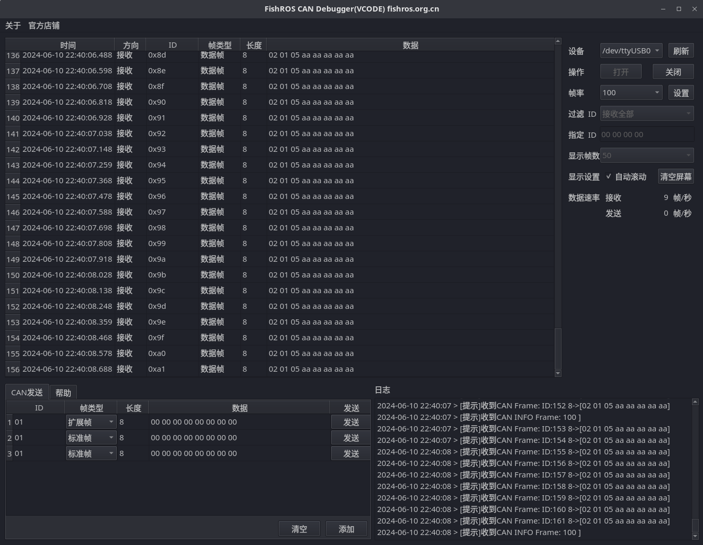

# FishROS CAN 调试工具

配套FishROS ROS2 多协议传输控制板（支持CAN/485/IO INPUT/IO OUTPUT）使用。[购买链接](https://m.tb.cn/h.g4sKEcOnkEoye4m?tk=o3wOWCqHrlL)：https://m.tb.cn/h.g4sKEcOnkEoye4m?tk=o3wOWCqHrlL

## 使用方法

### 直接下载

到[release](https://github.com/fishros/fishros_can_debug/releases)页面下载构好的二进制文件（Linux需要下载后右击勾选可执行）双击运行即可。

bin 目录为配套固件，不定期更新。

- 版权所有(鱼香ROS fishros.com)